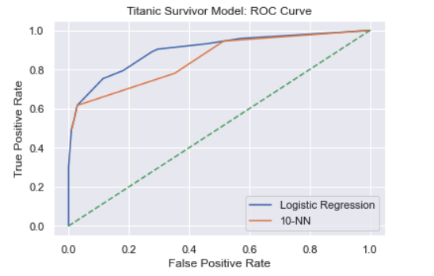

<h1>Dead or Alive: Predicting Survival on the Titanic Using Machine Learning</h1>

<h3>Abstract:</h3> On April 15, 1912,the Titanic, the worlds largest passenger liner Titanic sank into the North Atlantic Ocean about 400 miles south of Newfoundland, Canada killing more than 1500 passengers. Using machine learning methods and algorithms, this project will be using the Titanic Survivors dataset from Kaggle.com to predict the survivability of passengers based on features such as age, sex, embarkment origin etc.   

<h3>Goal:</h3> The purpose of this project was to create a predictive classification model to identify who would have survived the sinking of the Titanic. This analysis seeks to establish a meaningfully predictive classification model for predicting survivors. I am hoping to build a model and obtain acceptable accuracy, precision, recall and F1 scores.

<h3>Process:</h3> I used the Kaggle dataset with 891 rows (training data) of passenger features with a mix of quantitative and qualitative features. Some data transformation and one-hot encoding was needed to deal with categorical data. I performed EDA and some feature engineering to create models using kNN, Random Forest, Logistic Regression and others. 

 
<h3>Initial Findings:</h3> Using Logistic Regression and kNN, my models suggest that using Sex, pClass and Embarkment were the best features to determine survivability. 

 

<h3>Next Steps:</h3> Moving forward, I will be perform more feature engineering to attempt to improve model scores. I will also be employing the following algorithms:</h3>

- Random Forest
- Naïve Bayes
- Stochastic Gradient Descent
- ExtraTrees
- Bagging
- AdaBoost
- Decision Tree
- XGB 
- SVC()